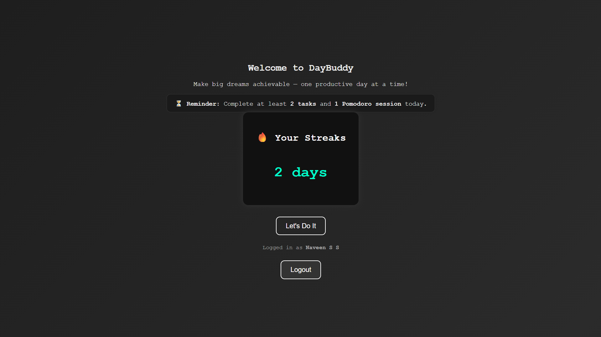

# DayBuddy

A full-stack productivity platform designed to help students turn big semester-long goals into daily wins. Set and track your to-dos, long-term goals, Pomodoro sessions, and habit streaks—all in one elegant dashboard.  

---

## Key Features

- User Authentication  
  Sign in with Google (OAuth2) for private, per-user data.

- Daily Task Planner  
  - Add, edit, delete, and complete tasks.  
  - Tasks tied to your account.

- Long-Term Goals  
  - Track semester-long objectives.  
  - Mark goals as completed when you achieve them.

- Pomodoro Timer  
  - Fully customizable work/break durations.  
  - Automatic session logging.  
  - Bell sound at session end.  

- Habit Streaks  
  - Automatic streaks when you complete ≥2 tasks and 1 Pomodoro per day.  
  - Resets if you miss the next day.  
  - Stores each day’s streak in history for later analysis.

- My Resources  
  - Save, name, and launch up to four custom links (websites, study tools).  
  - Displayed as favicon-labeled “cards” for quick access.

- Progress Overview  
  - Visualize your last 30 days of “all criteria met” days.  
  - Progress page accessible from the navbar.

- Motivational Quotes  
  - A fresh, bite-sized quote each visit to keep you inspired.

---

## Tech Stack

- Backend: Node.js, Express  
- Database: PostgreSQL (via `pg` client)  
- Auth: Passport.js (Google OAuth2)  
- Templating: EJS  
- Styling: CSS (modern, dark aesthetic)  
- Session: `express-session`  

---

## Installation & Setup

1. Clone the repo  
   ```bash
   git clone https://github.com/yourusername/daybuddy.git
   cd daybuddy
   ```

2. Install dependencies  
   ```bash
   npm install
   ```

3. Create your `.env` in the project root:
   ```env
   DB_USER=postgres
   DB_HOST=localhost
   DB_NAME=daybuddy
   DB_PASS=your_db_password
   DB_PORT=5432

   GOOGLE_CLIENT_ID=your_google_oauth_client_id
   GOOGLE_CLIENT_SECRET=your_google_oauth_client_secret
   ```

4. Initialize your database  
   - Run your SQL migrations or manually create tables based on:
     - `users`, `todos`, `goals`, `habits`, `daily_logs`, `streak_history`, `resources`  
   - Ensure `daily_logs` has a unique `(log_date, user_id)` constraint.

5. Start the server  
   ```bash
   npm start
   ```
   Visit `http://localhost:3000`.

---

## Database Schema Overview

| Table            | Key Columns                    | Notes                                                              |
|------------------|--------------------------------|--------------------------------------------------------------------|
| users            | id, google_id, username        | Stores registered Google users                                     |
| todos            | id, user_id, task, is_done     | Your daily to-dos                                                  |
| goals            | id, user_id, goal_text, is_completed | Semester-long objectives                                    |
| habits           | id, user_id, habit_name, streak_count, last_checked | Tracks habit streaks                    |
| daily_logs       | log_date, user_id, task_done_count, pomodoro_done, streak_incremented | Daily activity summary |
| streak_history   | user_id, date, streak_on_day   | Snapshot of streak after each increment                            |
| resources        | id, user_id, name, url         | Saved links for quick access                                       |

---

## Usage

1. Log in via Google on the home page.  
2. Onboarding  
   - If first time, add at least one habit.
3. Tasks & Goals (`/tasks`)  
   - Add daily tasks, complete them, and track long-term goals.
4. Pomodoro (`/pomodoro`)  
   - Start, pause, reset, and configure timers.
5. Habit Streaks  
   - Automatically updated when you complete ≥2 tasks + 1 Pomodoro in a day.
6. Resources (`/resources`)  
   - Save up to 4 custom links for study tools or reference sites.
7. Progress (`/progress`)  
   - View your past 30-day completion heatmap.

---

## Styling & Theming

- Dark, high-contrast aesthetic.  
- Pure black or subtle gradients for backgrounds.  
- Monospace headings for a “tech” vibe, Segoe UI for readability.  
- Consistent button and card styling across pages.

---

## Screenshots

### 1️⃣ Login Page


### 2️⃣ Dynamic Quote - Login Page
.png)

### 3️⃣ Home Page


### 4️⃣ Tasks & Goals Page


### 5️⃣ Pomodoro Timer Page


### 6️⃣ Resources Page


### 7️⃣ Progress Page


### 8️⃣ About Page


### 9️⃣ Navbar


### 🔟 Favicon


---

## Future Enhancements

- Email reminders when you’re close to breaking your streak.  
- Mobile-responsive layout.  
- Analytics dashboard with charts showing weekly/monthly trends.  
- Social sharing: brag about your streaks or goals.

---

Made for students who want to turn ambition into action — one day at a time.  
DayBuddy: Your academic success companion.
