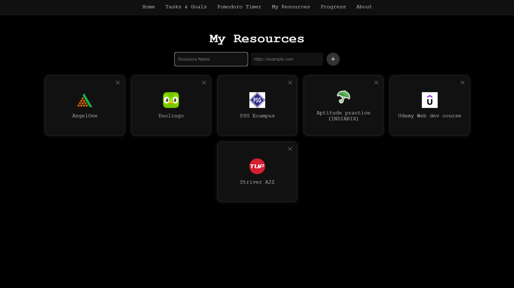

# DayBuddy

A full-stack productivity platform designed to help students turn big semester-long goals into daily wins. Set and track your to-dos, long-term goals, Pomodoro sessions, and habit streaks—all in one elegant dashboard.  

---

## Key Features

- User Authentication  
  Sign in with Google (OAuth2) for private, per-user data.

- Daily Task Planner  
  - Add, edit, delete, and complete tasks.  
  - Tasks tied to your account.

- Long-Term Goals  
  - Track semester-long objectives.  
  - Mark goals as completed when you achieve them.

- Pomodoro Timer  
  - Fully customizable work/break durations.  
  - Automatic session logging.  
  - Bell sound at session end.  

- Habit Streaks  
  - Automatic streaks when you complete ≥2 tasks and 1 Pomodoro per day.  
  - Resets if you miss the next day.  
  - Stores each day’s streak in history for later analysis.

- My Resources  
  - Save, name, and launch up to four custom links (websites, study tools).  
  - Displayed as favicon-labeled “cards” for quick access.

- Progress Overview  
  - Visualize your last 30 days of “all criteria met” days.  
  - Progress page accessible from the navbar.

- Motivational Quotes  
  - A fresh, bite-sized quote each visit to keep you inspired.

---

## Tech Stack

- Backend: Node.js, Express  
- Database: PostgreSQL (via `pg` client)  
- Auth: Passport.js (Google OAuth2)  
- Templating: EJS  
- Styling: CSS (modern, dark aesthetic)  
- Session: `express-session`  

---

## Installation & Setup

1. Clone the repo  
   ```bash
   git clone https://github.com/yourusername/daybuddy.git
   cd daybuddy
   ```

2. Install dependencies  
   ```bash
   npm install
   ```

3. Create your `.env` in the project root:
   ```env
   DB_USER=postgres
   DB_HOST=localhost
   DB_NAME=daybuddy
   DB_PASS=your_db_password
   DB_PORT=5432

   GOOGLE_CLIENT_ID=your_google_oauth_client_id
   GOOGLE_CLIENT_SECRET=your_google_oauth_client_secret
   ```

4. Initialize your database  
   - Run your SQL migrations or manually create tables based on:
     - `users`, `todos`, `goals`, `habits`, `daily_logs`, `streak_history`, `resources`  
   - Ensure `daily_logs` has a unique `(log_date, user_id)` constraint.

5. Start the server  
   ```bash
   npm start
   ```
   Visit `http://localhost:3000`.

---

## Database Schema Overview

| Table            | Key Columns                    | Notes                                                              |
|------------------|--------------------------------|--------------------------------------------------------------------|
| users            | id, google_id, username        | Stores registered Google users                                     |
| todos            | id, user_id, task, is_done     | Your daily to-dos                                                  |
| goals            | id, user_id, goal_text, is_completed | Semester-long objectives                                    |
| habits           | id, user_id, habit_name, streak_count, last_checked | Tracks habit streaks                    |
| daily_logs       | log_date, user_id, task_done_count, pomodoro_done, streak_incremented | Daily activity summary |
| streak_history   | user_id, date, streak_on_day   | Keeps a history of your streaks over time (Progress Heatmap)                            |
| resources        | id, user_id, name, url         | Saved links for quick access                                       |

---

# DayBuddy – Workflow

DayBuddy is a minimalist productivity companion that helps you **make big dreams achievable — one productive day at a time**.  
It combines **habits, tasks, goals, Pomodoro sessions, streak tracking, resources, and progress visualization** — all in one intuitive platform.

## 1. Authentication & Home Page

- **Login with Google OAuth** to access the app.  
- Once logged in, the home dashboard shows:  
  - **Dynamic motivational quote** (changes every refresh).  
  - **Current streak count**.  
  - **"Let’s Do It!" button** → jump into the app.  
  - **Logout button**.  

## 2. Tasks & Goals (`/tasks`)

- **Tasks** → Manage your daily to-dos.  
  - Add, edit, delete, and mark as done.  
  - Every completed task increments the `task_done_count` in `daily_logs`.  
- **Goals** → Manage semester/long-term objectives.  
  - Add, edit, complete, or remove goals.  

## 3. Pomodoro (`/pomodoro`)

- Use a **customizable Pomodoro timer** (start, pause, reset).  
- **Completion of a single session** updates the `pomodoro_done` field in `daily_logs`.  
- Together with tasks, Pomodoro sessions feed into **habit streak logic**.  

## 4. Habit Streaks

- **Rule**: Completing **at least 2 tasks and 1 Pomodoro in a day** increments the streak.  
- Streak tracking updates three tables:  
  - `habits.streak_count` → live running streak.  
  - `daily_logs.streak_incremented` → marks the increment for the day.  
  - `streak_history.streak_on_day` → stores historical streak growth for trend analysis.  
- Missed days do not increment streaks.  

## 5. Resources (`/resources`)

- Save **unlimited custom links** for tools, docs, or study sites.  
- Uses **Google Favicon API** to auto-fetch website icons for a clean, user-friendly UI.  
- Provides quick access to productivity essentials.  

## 6. Progress (`/progress`)

- Displays a **30-day completion heatmap** using `daily_logs`.  
- Each day is marked as:  
  - **Green** → Streak met (≥ 2 tasks and 1 Pomodoro).  
  - **Grey** → Streak not met.  
- Helps visualize **consistency and growth over time**.

## 7. About (`/about`)

- **About DayBuddy** → Explains the app’s purpose and philosophy.  
- **About the Developer**:  
  - I’m **Naveen S S**, IT student at PSG College of Technology.  
  - Passionate about **full-stack development, UI/UX design, and productivity tools**.  
  - Built DayBuddy to help students and professionals **stay focused, track progress, and cultivate discipline**.  
- **Get in Touch** → Links to **LinkedIn, GitHub, Gmail**.  

## 8. Behind the Scenes (Tech Flow)

1. **Express + PostgreSQL** backend with Google OAuth via Passport.js.  
2. `daily_logs` table ensures all activity (tasks, Pomodoro, streaks) is tracked per day.  
3. `updateStreakIfNeeded()` function checks conditions and updates streaks automatically.  
4. Midnight cron-like check ensures streaks are updated consistently.  
5. **EJS views + Tailwind CSS** provide a clean, minimalist UI.  

---

## Styling & Theming

- Dark, high-contrast aesthetic.  
- Pure black or subtle gradients for backgrounds.  
- Monospace headings for a “tech” vibe, Segoe UI for readability.  
- Consistent button and card styling across pages.

---

## Screenshots

### 1️⃣ Login Page


### 2️⃣ Dynamic Quote - Login Page
.png)

### 3️⃣ Home Page


### 4️⃣ Tasks & Goals Page


### 5️⃣ Pomodoro Timer Page


### 6️⃣ Resources Page


### 7️⃣ Progress Page


### 8️⃣ About Page


### 9️⃣ Navbar


### 🔟 Favicon


---

## Future Enhancements

- Email reminders when you’re close to breaking your streak.  
- Mobile-responsive layout.  
- Analytics dashboard with charts showing weekly/monthly trends.  
- Social sharing: brag about your streaks or goals.

---

Made for students who want to turn ambition into action — one day at a time.  
DayBuddy: Your academic success companion.
